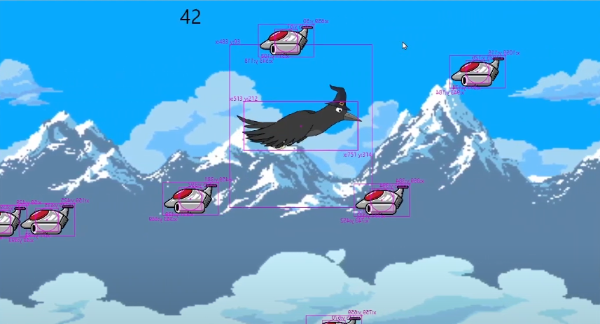

# Crow Horizontal Scroller Tutorial for Flame

Code for tutorial on basic Flutter Flame game development.
Intended for novices.  Target audience is a teenager.

[web demo](https://codetricity.github.io/crow_tutorial/)

## YouTube Tutorials

[full playlist](https://youtube.com/playlist?list=PLxvyAnoL-vu4qgIk4tit5xOt2j7SWD5ni&si=EnSIkaIECMiOmarE)

1. [Flutter Flame Infinite Scrolling Background](https://www.youtube.com/watch?v=I8OJQQ0X2p0&list=PLxvyAnoL-vu4qgIk4tit5xOt2j7SWD5ni&index=1)
2. [Flame Parallax Background for Side Scroller](https://www.youtube.com/watch?v=0YiTJs4WQKM&list=PLxvyAnoL-vu4qgIk4tit5xOt2j7SWD5ni&index=2)
3. [Flame Sprite Animation Intro for Side Scroller Game](https://www.youtube.com/watch?v=mMQfjt0kGKY&list=PLxvyAnoL-vu4qgIk4tit5xOt2j7SWD5ni&index=3)
4. [Flame Gravity and Acceleration Simplified Implementation](https://www.youtube.com/watch?v=kMEOlJhSslU&list=PLxvyAnoL-vu4qgIk4tit5xOt2j7SWD5ni&index=4)
5. [Flame Router and Multiple Game Screens](https://www.youtube.com/watch?v=A37hQOR-Few&list=PLxvyAnoL-vu4qgIk4tit5xOt2j7SWD5ni&index=5)
6. [Flame Enemy Spawn, Collision Detection, Enemy Removal](https://www.youtube.com/watch?v=zrTHXf2PUlU&list=PLxvyAnoL-vu4qgIk4tit5xOt2j7SWD5ni&index=6)
7. [Flame Start Screen with Router and Game Play Time](https://www.youtube.com/watch?v=zrTHXf2PUlU&list=PLxvyAnoL-vu4qgIk4tit5xOt2j7SWD5ni&index=7)
8. [Increase Enemy Spawn Rate in Flutter Games with Flame](https://www.youtube.com/watch?v=zrTHXf2PUlU&list=PLxvyAnoL-vu4qgIk4tit5xOt2j7SWD5ni&index=8)
